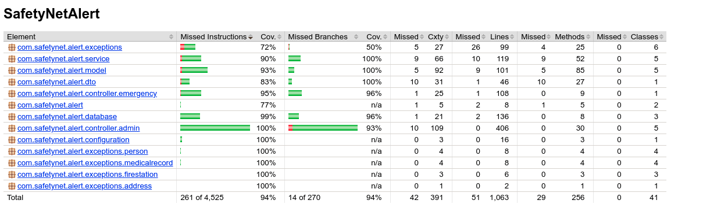

# SafetyNetAlert

SafetyNetAlert is a back-end java application that gives essential informations to emergency's services through a RESTfull API.

For examples,SafetyNetAlert can provide:
* the location of persons in a sector during a fire
* their number of phone and addresses to alert them of a weather accident
* their medical history to help emergency services to work correctly

## Running the application locally

There are several ways to run application on your local machine. One way is to execute the `main` method in the `com.safetynet.alert.SafetyNetApplication` from your IDE.

Alternatively you can use the [Spring Boot Maven plugin](https://docs.spring.io/spring-boot/docs/current/reference/html/build-tool-plugins-maven-plugin.html) like so:

```shell
mvn spring-boot:run
```
## Access and Endpoints
Since application started, you can access to all endpoints of REST API with the URL:

```html
https://localhost:8080/
```
Below you can find list of all endpoints with their descriptions and uses explained in API documentation located at:

```html
http://localhost:8080/swagger-ui/
```
For a better organization of endpoints , they are regrouping in two sections :

* **Administration :** to manage all endpoints relative to entities ( Person, FireStation, MedicalRecord).
* **Emergency:** to manage all endpoints relative to URLS 


<div style="display:flex;flex-direction: row;">
`
     

</div>

## Run test

We used TDD to implement code in this project:

So, from creation of integration and unit tests, we created the source's code and check it to be sure of its correct working.

* To run unit tests only, you can use command:

```shell
mvn:test
```
* To run integration tests only, you can use command:

```shell
mvn failsafe:integration-test
```
* If you want to launch a build phase without integration tests, you can use next option for example:

```shell
mvn verify -Dskip.it=true
```
## Jacoco Coverage

A report of coverage is automatically done when you launch tests.

you can access to it at location :`target/site/jacoco/index.html`

<div style="display:flex;flex-direction: row;">

</div>

## Site and Reports

We created a site with Maven to aggregate different reports:


* 	**SureFire Report** for all unit Tests.
* 	**Jacoco Report** for coverage in Junit Tests.
* 	**Javadoc Report** on src/main/java. 


To deploy the site use the command:

```shell
mvn site
```
and in `target/site` you will find a page index.html that you can open in your web browser witch contains these different reports:

## Application was built with

* `SpringBoot 2.4.4`
* `Java 8`
* `Maven 3.6.3`
* `H2 and Mysql databases`
* `JUnit`
* `Jacoco`
* `Log4j`

## Versions

* **V0.0.1**	: 	First version of the project. implementation of Structure only.


* **V0.1.0**	: 	Second version, implementation of code using TDD:


		1. creation of Service to load Data from a source using a strategy pattern in CommandLineRunner.
		2. creation of Rest Controller for administration that manages Entities Person,FireStation,MedicalRecord, Medication and Allergy.
		3. creation of global handler Exceptions to manage exceptions from Controllers 
		4. implementation of javadoc and update code to check checkStyle's rules.
		
* **V0.2.0**	:	Third version with creation of RestController for Emergency's services using TDD:


		1. creation of Rest Controller for emergencies' services that manage URLS (fireStation,childAlert,phoneAlert,fire,flood,personInfo and communityEmail)
		2. creation of Model Response to make more easily readable the body of each URLS's ResponseEntity
		3. activation and configuration of actuator for health, info, metrics and httpTrace
		4. implementation of javadoc and check for chekstyle rules.
		
* **V1.0.0**	:	Forth and Lastest version of application with upgrade tests and documentation::

		1. Update relationship between Person and fireStation to M:M
		2. Update Model Response to PersonDto for more readable response for each URL's endpoint
		3. Update and check all UT and IT for the application
		4. Creation of Api Documentation with swagger2 and mvn site with reports
		5. Management of Actuator: health,info,trace and metrics.